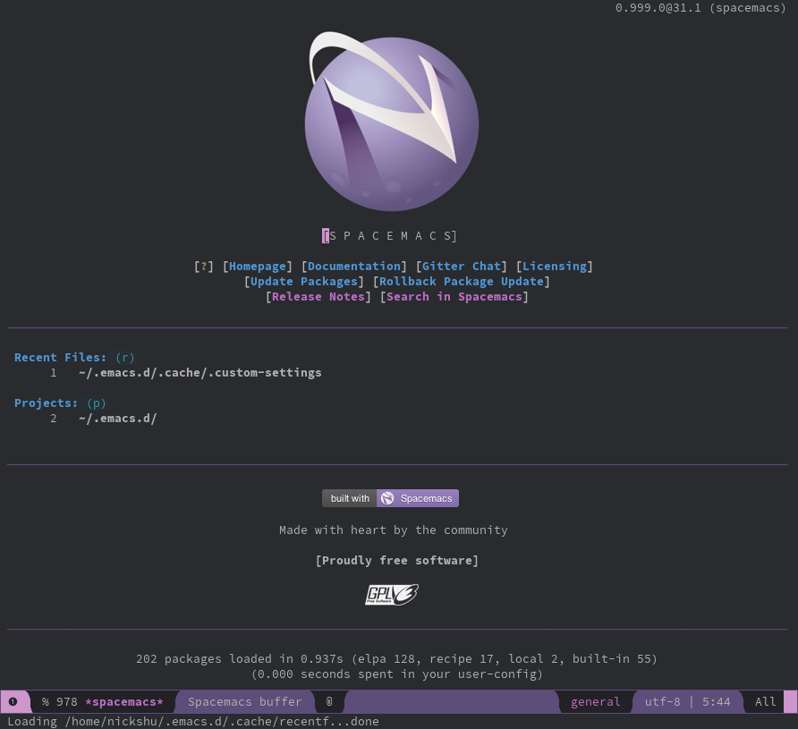

#+TITLE: Installation

For this tutorial, we will be using Spacemacs as our entry point to using Emacs. Please follow the steps below to get Spacemacs setup for your system.

* Emacs
** Windows

*** Get the Installer

If you use Chocolatey, you may install it via

#+BEGIN_SRC shell
choco install emacs
#+END_SRC

Otherwise, the easiest method is to go to the [[https://www.gnu.org/software/emacs/download.html][GNU Emacs Download page]] and get to the file server for a [[http://ftpmirror.gnu.org/emacs/windows][nearby GNU mirror]]. You may choose any version. For this guide, select =emacs-30/= and then select =emacs-30.2.installer.exe=. Next, run the installer.

  - Click on =Next >=, then read their copyleft license, click on =OK=. 
  - Next, choose a destination folder. You may leave it at =C:\Program Files\Emacs=.
  - Next, you may create a Start Menu folder.
  - Once ready, click on =Install=

*** Setting Up Dotfiles

Unix systems often use dotfiles for their configuration. If you use a tiling window manager, you're likely extremely familiar with this concept. Dotfiles are effectively ASCII files that have text configurations for an application or for an entire system. It therefore becomes very easy to edit simple files and change entire configurations without having to go through setting dialogs.

By default, Emacs on Windows looks for configurations in the =%AppData%= directory (i.e., =C:\Users\USERNAME\AppData\Roaming=). This can be changed by setting an explicit =HOME= environment variable, which results in GNU Emacs to look in that location instead, which matches with Unix behaviors.

  - Run the command (i.e., =Win+R=) =sysdm.cpl=
  - Open the =Advanced= tab
  - Click on the =Environment Variables...= button
  - Under the =Environment Variables= window and under the =User variables for USERNAME=, click on =New...= button
  - Under =New User Variable= window, enter the following values:
    + Variable name: =HOME=
    + Variable value: =C:\Users\USERNAME=
  - Click on =OK= to close the =New User Variable=, =OK= to close the =Environment Variables=, then =OK= to close the =System Properties= window.

Clean up any previous existing configuration directories by removing =.emacs.d= and =.emacs= from the =C:\Users\USERNAME= directory (i.e., =$env:USERPROFILE= in PowerShell or =%USERPROFILE%= in Command Prompt).

*** Installing Spacemacs

Now that the configuration directory is cleared, bring in the default configurations from Spacemacs

#+BEGIN_SRC shell
# In PowerShell
git clone https://github.com/syl20bnr/spacemacs $env:USERPROFILE/.emacs.d

# In Command Prompt
git clone https://github.com/syl20bnr/spacemacs %USERPROFILE%/.emacs.d
#+END_SRC

At this point, Spacemacs will be Installed. 

** GNU/Linux

*** Arch Linux

If using an Arch-based distribution, you can just install the =emacs= package. Or you may look through [[https://wiki.archlinux.org/title/Emacs][Arch Wiki's Emacs page]].

You may wish to install Source Code Pro font, which is the default font for Spacemacs

#+begin_src shell
pacman -S ttf-adobe-source-code-pro-fonts
#+end_src

*** Ubuntu

The following is the best way to install Emacs on an Ubuntu system, taken from [[https://gist.github.com/shanbhardwaj/866f20e98303379ca8bfbe2f0c5b7a87][Shanbhardwaj's Gist]]. (Copied on 2026-06-15). The reason this is used is because a lot of the public repositories have outdated Emacs versions.

#+BEGIN_SRC shell
# Setting up Emacs in our source directory
mkdir -p ~/src && cd ~/src
git clone --depth 1 --branch emacs-30 git://git.savannah.gnu.org/emacs.git
cd emacs
git checkout emacs-30

# Enable development libraries and update apt cache
# for Ubuntu >= 24.04
sudo sed -i 's/^Types: deb$/Types: deb deb-src/' /etc/apt/sources.list.d/ubuntu.sources && apt update

# for ubuntu < 24, uncomment and use the following
# sudo sed -i 's/# deb-src/deb-src/' /etc/apt/sources.list && apt update

# Install necessary dependencies
sudo apt build-dep -y emacs \
  && sudo apt install libtree-sitter-dev

# Generate the configure file
./autogen.sh

# Configure Emacs with desired options
# --with-ctags --with-dbus --with-debug --with-mailutils --with-x11 --with-xwidgets
./configure --with-imagemagick

# Compile with 4 cores
make -j4 bootstrap

# Verify the version
./src/emacs --version

# Optionally, test things by launching Emacs without any configuration
./src/emacs -Q

# When things look good, install Emacs system-wide
sudo make install
#+END_SRC

You may wish to install Source Code Pro font, which is the default font for Spacemacs

#+begin_src shell
sudo apt-get install fonts-source-code-pro
#+end_src

** First Startup in Spacemacs

Your first boot up of Spacemacs will yield a few questions. Enter the following answers:

1. What is your preferred editing style? (*v*im, *e*macs, *h*ybrid)
  - =v= / Vim

2. What distribution of spacemacs would you like to start with? (*s*pacemacs, spacemacs-*b*ase)
  - =s= / spacemacs

Depending on your system, it may try to install 126 packages and may struggle. After its initial setup, you should see the first instantiation of Spacemacs.

If the system may be dealing with proxies, see below

** Handling Proxies

It is possible that your system may exist behind a proxy. For that, edit the file =C:\Users\USERNAME\.spacemacs=, go to line 84, and inside the =dotspacemacs/init= function, add the following (according to your organization):

#+BEGIN_SRC elisp
(defun dotspacemacs/init ()
  ;; Add proxies
  (setq url-proxy-services
    '(("http" . "proxy.lan.organization.com:8080")
      ("https" . "proxy.lan.organization.com:8080")
    )
  )
  ...
)
#+END_SRC

This will enable GNU Emacs to fetch all of its default packages.

* LaTeX (Optional for Lesson 6)

** Windows

There are a few requirements that will likely help your process first. Given that LaTeX is an incredibly mature document generation software, it's recommended to install LaTeX first.

You may use [[https://miktex.org/][MiKTeX]] or the TeX Users Group's [[https://www.tug.org/texlive/][TeXLive]] to install the LaTeX binaries.

#+BEGIN_QUOTE
MiKTeX will be significantly faster to install than TeXLive because MiKTeX installs only the basic LaTeX functionality.
#+END_QUOTE

*** Option 1: Install TeXLive

Obtain the installer file from this [[https://mirror.ctan.org/systems/texlive/tlnet/install-tl-windows.exe][link]] or follow the steps below:
  - Visit the [[https://www.tug.org/texlive/][TeXLive website]], and click on =install on Windows= link to obtain the installer.
  - In the next link, look for =Easy install= and download the =install-tl-windows.exe= file.

Open the installer file and select =Install= and click on =Next= and then =Install=.

[[./assets/images/pandoc_in_windows/texlive_installer_01.png]]

After it's done unpacking, it will ask you to choose a mirror. Choose the mirror that is closest to you. Do NOT close the first window. Keep it opened.

[[./assets/images/pandoc_in_windows/texlive_installer_02.png]]

Next, choose whichever Installation root you prefer, and, for United States, choose the =Default paper size= to be =Letter=. Then click =Install=.

*** Option 2: Install MiKTeX

Visit the [[https://miktex.org/][MiKTeX website]] and click on =Download= on the top. Next, select your operating system, and download the installer.

Follow the instructions to install MiKTeX.

** GNU/Linux

*** Arch Linux
If you're using Arch, you know the drill; RTFM

https://wiki.archlinux.org/title/TeX_Live

*** Ubuntu

If you're using ubuntu, you may use any of the following TeX Live options:

#+begin_src shell
# Basic install
sudo apt install texlive

# Recommended extra
sudo apt install texlive-latex-extra

# Full install
sudo apt install texlive-full
#+end_src

At this point, you should have access to some of the following binaries (and more):

- =pdflatex=
- =xelatex=
- =lualatex=
- =latex=
- =pdftex=
