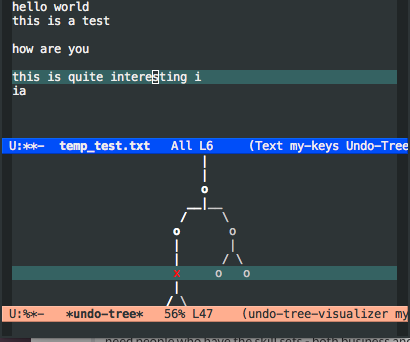

#+TITLE: Text Editor

** Treemacs

Add the following to =dotspacemacs-configuration-layers=, and then reload your Spacemacs configuration =SPC f e R=

#+begin_src elisp
treemacs
#+end_src

Open a file in your system via =find-file= / =SPC f f=. Next, run the command =treemacs= / =SPC f t=

** Evil Mode

Add the following to =dotspacemacs-configuration-layers=, and then reload your Spacemacs configuration =SPC f e R=

#+begin_src elisp
;; Increment and Decrement numbers
(global-set-key (kbd "C-a") 'evil-numbers/inc-at-pt)
(global-set-key (kbd "C-S-A") 'evil-numbers/dec-at-pt)
#+end_src

This will give you new types of keybindings to your vim keybindings

** Undo Tree

As a *temporary* install, let's run the following command:

  - =M-x package-install undo-tree RET=

Now, edit a file, and do a few undos (Under Vim keybindings, you can use =u= and use =C-r= to redo). Then, you can activate the =undo-tree-mode= by running the following in order:

  - =M-x undo-tree-mode=
  - =undo-tree-visualize= / =C-x u=

Now you can navigate through an undo tree to see previous changes.
