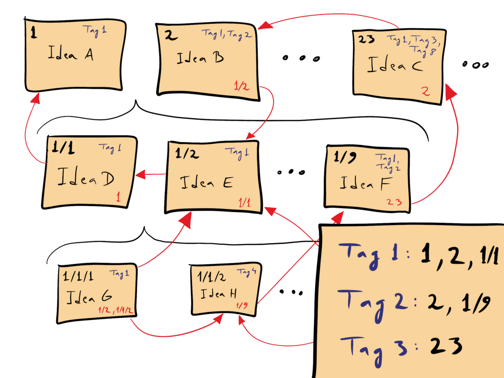

#+TITLE: Org-Roam

* Zettelkasten

Zettelkasten is a knowledge management system aimed to help people store lots of referenced informations. It consists of lot of small items of informations stored in paper slips or cards that link to each other via an organized method of headings or tags.

When you extend it, you end up getting something like an extensive knowledge management system like Wikipedia.

* Installation

TODO

In order to setup org-roam, you'll need to setup a few variables:

#+begin_src elisp
(org-roam-directory (file-truename "~/path/to/org-roam-notes"))
#+end_src

* Usage

In Org-Roam, the main things you'll need are to:

  - open/create a file
  - insert a note elsewhere

    
Under Spacemacs, you can find a plethora of other options relating Org-Roam via =SPC a o r=.

#+begin_src org
[SPC] Shortcuts
  - [a] applications
    - [o] org
      - [r] roam
#+end_src

Under Doom Emacs, you can find similar options in =SPC n r=

#+begin_src org
[SPC] Shortcuts
  - [n] notes
    - [r] roam
#+end_src

So, in order to create open/create a new file, you may do:

  - =org-node-roam-find=
  - =SPC a o r f= (Spacemacs)
  - =SPC n r f= (Doom Emacs)

In order to insert a link

   - =org-node-roam-insert=
   - =SPC a o r i= (Spacemacs)
   - =SPC n r i= (Doom Emacs)

When you create a new node, you may find something like this:

#+begin_src org
:PROPERTIES:
:ID:       b34142e0-c42b-4387-8929-5f90ae2e8f9a
:END:
#+title: Name of the Note
#+filetags: :Teaching:
#+end_src

The =PROPERTIES= > =ID= is automatically generated for our convenience. This is what identifies the node, but also what enables unique links to create connections throughout an entire network of nodes.

** Reproducibility

One of the beauties regarding Org-Roam is that the entire schema is stored in the files themselves, and that it is reproducible. Everything is stored in a flat-file structure. This means that if your OS gets destroyed or if you wish to move your notes elsewhere, as long as you bring these files, you can reproduce your entire Org-Roam notes simply from your file structure.

* Org-Roam-UI

TODO

In order to use Org-Roam-UI, you can simply activate its mode via =M-x org-roam-ui-mode= and it will be launched under http://127.0.0.1:35901.

* More Customization

If you wish to create new types of emplates, you can add the Elisp below.

#+begin_src elisp
(setq org-roam-capture-templates
'(
    ("d" "default" plain
    "%?"
    :if-new (file+head "${slug}.org" "#+TITLE: ${title}\n#+LATEX_HEADER: \\usepackage[margin=0.5in]{geometry}\n#+LATEX_HEADER: \\usepackage{minted}\n#+LATEX_HEADER: \\usemintedstyle{emacs}\n#+LATEX_HEADER: \\usepackage[ttscale=0.7]{libertine}\n")
    :unnarrowed t)
    ("p" "private" plain
    "$?"
    :if-new(file+head "private-${slug}.org" "#+TITLE: ${title}\n#+LATEX_HEADER: \\usepackage[margin=0.5in]{geometry}\n#+LATEX_HEADER: \\usepackage{minted}\n#+LATEX_HEADER: \\usemintedstyle{emacs}\n#+LATEX_HEADER: \\usepackage[ttscale=0.7]{libertine}\n")
    :unnarrowed t
    )
    )
)
#+end_src

Here, =org-roam-capture-templates= is a list that contains two options at creation: =d= for default notes, and =p= for private notes. By using =file+head=, the notes follow a different template for filename and then for the header. Under the =head=, I took the liberty to add a few different LaTeX headers that may be useful.
