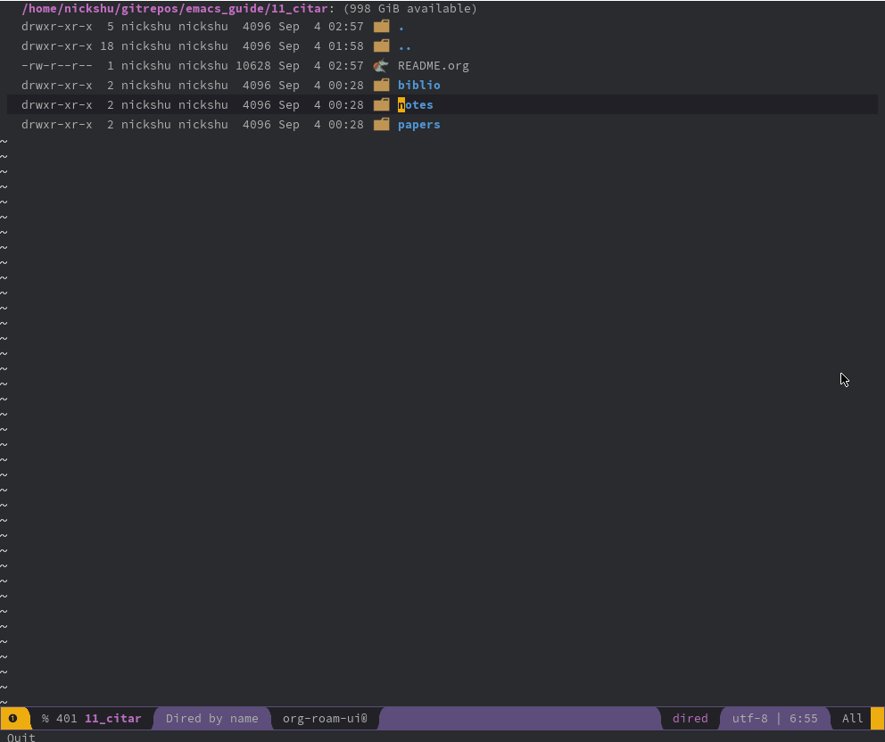

#+TITLE: Citation Management
** Citar

[[https://github.com/emacs-citar/citar][Citar]] is a citation management. I, as Nick Shu, have tried multiple types of citation managers. The ones I've had greatest successes with were Mendeley, Zotero, and even Papis, but I've always found problems with each of them.

Mendeley, was the first one that I was introduced to, and it was great. I loved the different types of features they had, but for the love of god, I hate Elsevier. And the storage limitations were real problems with Mendeley.

Zotero is a great contender for keeping track of your citations. It's great that Zotero is a FOSS, and licensed under the AGPL. It's great how it has browser connections, but it also had problems with storage limitations. There are work arounds to use WebDAVs to pair it up with Zotero, but in general, I wished it had a better method of transferability.

Papis is absolutely great. It is a TUI, and actually great for its expandability. It is able to work off of a flat file structure, its transferability is built into the files themselves, and you can use it in a huge variety of systems. Unfortunately TUIs are not for everybody. I highly recommend everyone to look into Papis.

I personally found that Citar is the best solution that I've found to this day. I absolutely love how it integrates with Org files, how you can pull files directly from URLs and how you can create individual notes for each of the publications.

** Installation

*** Completion

Now, Citar is amazing, but it doesn't support [[https://emacs-helm.github.io/helm/][Helm]] (which is the default completion/selection package shipped with Spacemacs), which is fine because Helm can be a little bloatey at times. Therefore, we'll use Vertico (combined with Marginalia and Embark) which is a lot slimmer and faster. For that:

- First deactivate the Helm layer
- Setup Vertico to be the completion engine
- Add Vertico and Marginalia onto the additional packages section

#+begin_src elisp
  (defun dotspacemacs/layers ()
    dotspacemacs-configuration-layers '(
                                        ;; helm
                                        (compleseus
                                         :variables
                                         compleseus-engine 'vertico)
                                        )
    dotspacemacs-additional-packages '(
                                       vertico
                                       marginalia
                                       )
  )
#+end_src

*** Citar

Now, Citar is ready to be setup. Below will be the steps for completion:

1. Install =citar= package
2. Setup bibliography sources
3. (Optional) 

Install =citar= by adding the entry to =dotspacemacs-additional-packages=

#+begin_src elisp
(defun dotspacemacs/layers ()
  dotspacemacs-additional-packages '(
                                     citar
                                     )
)
#+end_src

Next, define what is the bibliography, where the papers will be stored, and where your personal notes will be stored.

#+begin_src elisp
  (defun dotspacemacs/user-config ()
   ...
    (use-package citar
      :custom
      ;; Setup bibliography sources
      (citar-bibliography '(
                            "/path/to/emacs_guide/11_citar/biblio/bio.bib"
                            "/path/to/emacs_guide/11_citar/biblio/eng.bib"
                            )
                          )
      (citar-library-paths '("/path/to/emacs_guide/11_citar/papers"))
      (citar-notes-paths   '("/path/to/emacs_guide/11_citar/notes"))
      )
    )

  ;; Delete this section below
  (use-package citar
    :custom
    (citar-bibliography '(
                          "~/gitrepos/nick/emacs_guide/11_citar(wip)/biblio/bio.bib"
                          "~/gitrepos/nick/emacs_guide/11_citar(wip)/biblio/eng.bib"
                          )
                        )
    (citar-library-paths '("~/gitrepos/nick/emacs_guide/11_citar(wip)/papers"))
    (citar-notes-paths '("~/gitrepos/nick/emacs_guide/11_citar(wip)/notes"))
    )
  ...
  )
#+end_src

Once, this is setup, a huge advantage of this setup is that, if you ever wish to change computers or synchronize between multiple computers, as long as the file structure is consistent, you'll always be able to recover all of your data. In other words, like the setup for =org-journal=, =org-roam=, =org-agenda=, etc... the flat files contain ALL of the information necessary for recovery for your system.

See the Appendix section below for some QoL improvements.

** Usage

*** Navigating Citar

Once you have your system setup, you can open Citar via

  - =citar-open=

This will open a dialog under the minibuffer. This will show you all of the citations that you have across all of your =.bib= files.
The entries will show whether you have a local PDF file, whether you have the URL to find the resource, and where you have notes associated with the resource.

At this point, you may start typing keywords that may be in the title or the authors, or anything exposed by the =.bib= files.

Additionally, if you have not done the optional steps for QoL in the appendix, the files entries will be shown as

#+begin_src
  L        Hanahan         2022   Hallmarks of Cancer: New Dimensions     hallmark_of_can    article
  L        Viola, Jones    2001   Rapid object detection using a boos     viola_jones        INPROCEEDING    Object detection;Face detection;Pix
  L        Blank, Brown    1994   Adaptive, global, extended Kalman f     kalman_nn          article
  L F N    Jacqueline M    2025   Probabilistic Graphical Models: A C     pgms               misc
  L        Jigyasa Watw    2026   Growth phases of an active tissue:      growth_phase_ac    misc
  L        Exconder, Yo    2026   DIPTAR: A synthetic biology platfor     diptar             article
#+end_src

*** Add Your Resources

Your =.bib= files will act as the central place for list of publications you wish to save. That does not mean that you will have the actual resources themselves. So, at this point, let's add a resource file. Run the command:

  - =citar-add-file-to-library=

You will see a list of all of your bib entries. Once you've selected your entry, it will ask: =Add file from (buffer, file, url, ?): =. At this point, you may choose your the source:

  - =b=: Buffer
    + If you choose =b= / buffer, you will be adding a file associated with a buffer you have opened. The minibuffer listing all of the current buffers opened for you to choose.
  - =f=: File
    + If you choose =f= / file, you will get a dired that will allow you to choose the file that is to be associated with this resource
  - =u=: URL
    + If you choose =u= / URL, you will have the option of pasting the URL which will let it download the PDF of the resource. This URL must yield a public PDF, otherwise, it will get you HTML files.
  - =?=: Help menu

Now, add a file to the resource "pgms".

1. Run =citar-open= and open the link for "pgms"
2. Open the link for "pgms" by pressing ENTER
3. Add the file via URL
   1. Open the PDF file by clicking on "View PDF"
   2. Copy the PDF URL into your clipboard
   3. Open Emacs and run =citar-add-file-to-library=
   4. Select the "pgms" entry
   5. Select URL with =u=
   6. Paste the link via =C-y= (Yank in Emacs)
4. Add the file via file
   1. Open the PDF file by clicking on "View PDF"
   2. Download the PDF file
   3. Open Emacs and run =citar-add-file-to-library=
   4. Select the "pgms" entry
   5. Select "File" with =f=
   6. Navigate to the file using dired

Citar will identify the file and notes based on the entry index of the BibTex file. In other words, if the entry index is "lollipop", then Citar will be looking for files named:

  - =/path/to/papers/lollipop.pdf=
  - =/path/to/notes/lollipop.org=

Likewise, you may add notes. For this section, we may directly add notes by using the command:

Now, you will add notes to your resource. We will again run the following command:

  - =citar-open=

At this point, none of your resources will have notes, so choose whatever you want. Therefore, when you try to open a resource, it will say: "/Create Notes/". Choose that option. This will create an Org buffer which will be named after the entry name in your =.bib= file.

Then, later, in the future, you can open those same notes.

** Appendix

*** (Optional) Some QoL Improvements

The additions below are aimed to add icons to the Citar platform. First, add the =all-the-icons-completion= package to the =dotspacemacs-additional-packages=.

#+begin_src elisp
(defun dotspacemacs/layers ()
  dotspacemacs-additional-packages '(
                                     all-the-icons-completion
                                     )
)
#+end_src

Next, the following variables can be set under the =dotspacemacs/user-config=. For further information on how to customize citar, you may check the documentation of the Citar package

#+begin_src elisp
(defun dotspacemacs/user-config ()
  ;; Turn on all-the-icons-completion-mode in order to load:
  ;; + all-the-icons-faicon
  ;; + all-the-icons-octicon
  ;; + all-the-icons-material
  (all-the-icons-completion-mode)

  ;; Define elisp dynamic variables for indicators
  (defvar citar-indicator-files-icons
    (citar-indicator-create
     :symbol (all-the-icons-faicon
              "file-o"
              :face 'all-the-icons-green
              :v-adjust -0.1)
     :function #'citar-has-files
     :padding "  " ; need this because the default padding is too low for these icons
     :tag "has:files"))

  (defvar citar-indicator-links-icons
    (citar-indicator-create
     :symbol (all-the-icons-octicon
              "link"
              :face 'all-the-icons-orange
              :v-adjust 0.01)
     :function #'citar-has-links
     :padding "  "
     :tag "has:links"))

  (defvar citar-indicator-notes-icons
    (citar-indicator-create
     :symbol (all-the-icons-material
              "speaker_notes"
              :face 'all-the-icons-blue
              :v-adjust -0.3)
     :function #'citar-has-notes
     :padding "  "
     :tag "has:notes"))

  (defvar citar-indicator-cited-icons
    (citar-indicator-create
     :symbol (all-the-icons-faicon
              "circle-o"
              :face 'all-the-icon-green)
     :function #'citar-is-cited
     :padding "  "
     :tag "is:cited"))

  ;; Create the indicators
  (setq citar-indicators
        (list citar-indicator-files-icons
              citar-indicator-links-icons
              citar-indicator-notes-icons
              citar-indicator-cited-icons
              ))
)
#+end_src

