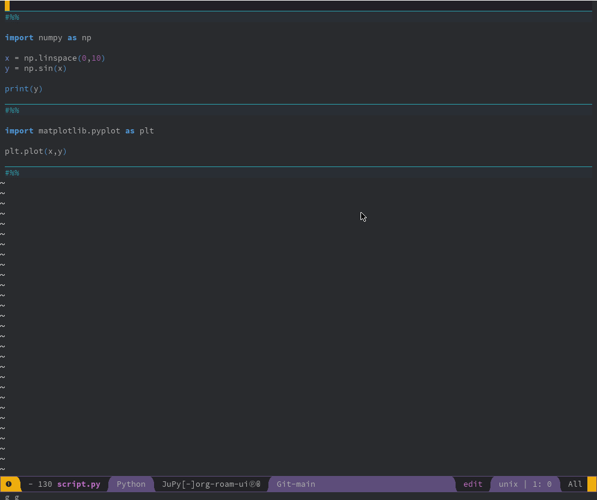
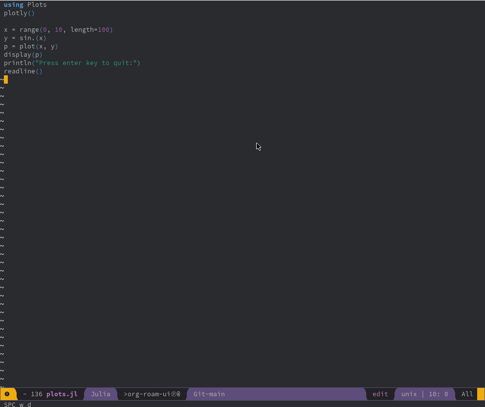

#+TITLE: Jupyter and Julia

** Jupyter

*** Pre-Requisites

First, install either Anaconda or Miniconda to make sure you have access to Jupyter

*** Installation

For this section, install the package from [[https://github.com/emacs-jupyter/jupyter][emacs-jupyter/jupyter]].

**** Spacemacs

Under Spacemacs, add =python= to =dotspacemacs-configuration-layers= and add =jupyter= to the =dotspacemacs-additional-packages=. 

#+begin_src elisp
  (defun dotspacemacs/layers ()
    "Layer configuration:
  This function should only modify configuration layer settings."
    (setq-default
     dotspacemacs-configuration-layers
     '(python
       ...
       )

     dotspacemacs-additional-packages '(
                                       jupyter
                                       )

     ...
     )
#+end_src

Then, set the variable =jupyter-repl-echo-eval-p= to true

#+begin_src elisp
(defun dotspacemacs/user-config ()
  (setq jupyter-repl-echo-eval-p t)
  )
#+end_src

*** Usage

**** Basic Usage

Start up a REPL

  - =jupyter-run-repl=

Then, you may send lines or regions via the command below

  - =jupyter-eval-line-or-region=
  - =C-c C-c=

**** Better Usage

The =python= module allows the user to create sections of code, similarly to VSCode and MATLAB. A section may be defined as =#%%= or =# %%=. As an example, it may be:

#+begin_src python
  #%%
  # This is a section
  x = 10
  y = 2 * x

  #%%
  # This is another section
  print(y)

  #%%
#+end_src

Here, we can define a new function in Elisp that will evaluate everything between the section markings. Therefore, add the following to the =dotspacemacs/user-config=

#+begin_src elisp
  ;; Custom Keybinding to evaluate region between two "#%%" tags
  (defun jupyter-eval-between-marks ()
    (interactive)
    (setq curr (point))
    (search-backward "#%%") (setq beg (point))
    (search-forward "#%%") (search-forward "#%%") (setq end (point))
    (jupyter-eval-region nil (+ beg 3) (- end 3))
    (goto-char curr)
    )

  (global-set-key (kbd "<C-return>") 'jupyter-eval-between-marks)
#+end_src

At this point, you may use =C-RET= in order to invoke =jupyter-eval-between-marks=.

** Julia

*** Installation
**** Spacemacs

Under Spacemacs, add =julia= to =dotspacemacs-configuration-layers=

#+begin_src elisp
  (defun dotspacemacs/layers ()
    "Layer configuration:
  This function should only modify configuration layer settings."
    (setq-default
     dotspacemacs-configuration-layers
     '(julia
       ...
       )
     ...
     )
#+end_src

*** Usage

Start a Julia REPL:

  - =julia-repl=
  - =, r= (Spacemacs)
  - TODO DOOM

Send commands to Julia REPL

  - =julia-repl-send-region-or-line=
  - =, e r= (Spacemacs)
  - TODO DOOM

Open the very simple file =plots.jl= and play around with it.
