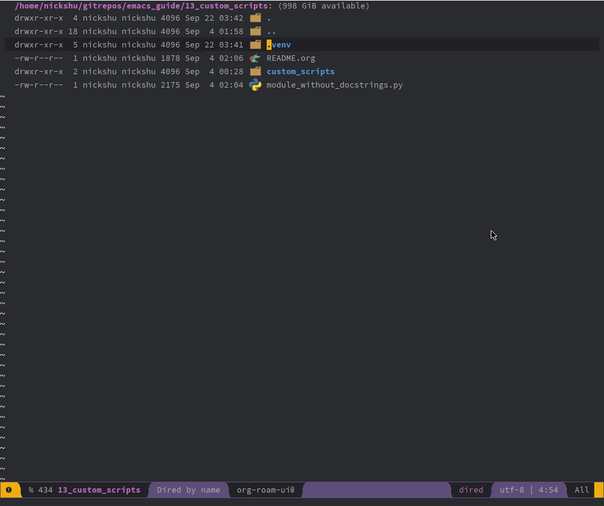

#+TITLE: Custom Scripts

People often say that Emacs is highly customizable. While it is true that one may create almost anything they may want on Emacs, it extends beyond simple Elisp code. This section will cover the usage of creating a new script in Python, and functionalizing it to work on Emacs.

The script =format-g-docs.py= is a script intended for creating Google style docstrings.

** Prerequisites

This example will rely upon the Python package =astunparse=. Therefore, it's advisable to create a local virtual environment.

#+begin_src shell
  python -m venv .venv
  source .venv/bin/activate
#+end_src

Next, install the package =astunparse=

#+begin_src shell
  pip install astunparse
#+end_src

** Installation

For this, look up the path for a Python instance and the path for the =format-g-docs.py=. For the purposes of this documentation:

  - Python path is =/usr/bin/python=
  - Path to =format-g-docs.py= is =/home/username/gitrepos/emacs_guide/13_custom_scripts/custom_scripts/format-g-docs.py=

Below, one may create a custom function that invokes the Python file. Place it under =dotspacemacs/user-config=

#+begin_src elisp
  (defun python-google-docstring ()
    "Generate google-style docstring for python."
    (interactive)
    (if (region-active-p)
        (progn
          (call-process-region (region-beginning) (region-end) "/usr/bin/python" nil t t "/home/username/gitrepos/emacs_guide/13_custom_scripts/custom_scripts/format-g-docs.py")
          (message "Docs are generated")
          (deactivate-mark))
      (message "No region active; can't generate docs!"))
    )
  (evil-leader/set-key "o o" 'python-google-docstring)

#+end_src

Now, you may invoke the new custom function. In order to get it function, select a region of a function/method definition, and invoke the new function with:

  - =python-google-docstring=
  - =SPC o o=

