# Local IspellDict: en
# SPDX-License-Identifier: GPL-3.0-or-later
# SPDX-FileCopyrightText: 2021,2025 Jens Lechtenbörger

#+OPTIONS: toc:nil reveal_width:1400 reveal_height:1000 num:nil
#+REVEAL_THEME: white

#+Title: Emacs Guide
#+Author: Nick Shu

#+REVEAL_ROOT: https://cdn.jsdelivr.net/npm/reveal.js@4.6.0
#+REVEAL_VERSION: 4
#+REVEAL_ADD_PLUGIN: chalkboard RevealChalkboard https://cdn.jsdelivr.net/npm/reveal.js-plugins@latest/chalkboard/plugin.js https://cdn.jsdelivr.net/npm/reveal.js-plugins@latest/chalkboard/style.css

# Workaround for issue #100, fixed upstream:
# #+REVEAL_HEAD_PREAMBLE: 

# Per its README, font awesome is required for the chalkboard plugin.
#+REVEAL_HEAD_PREAMBLE: 
#+REVEAL_HEAD_PREAMBLE: <link rel="stylesheet" href="https://cdnjs.cloudflare.com/ajax/libs/font-awesome/6.4.0/css/all.min.css">

# Custom controls can be used to display buttons for opening and
# closing annotation modes, see README of chalkboard plugin:
# https://github.com/rajgoel/reveal.js-plugins/tree/master/chalkboard
#+REVEAL_ADD_PLUGIN: customcontrol RevealCustomControls https://cdn.jsdelivr.net/npm/reveal.js-plugins@latest/customcontrols/plugin.js https://cdn.jsdelivr.net/npm/reveal.js-plugins@latest/customcontrols/style.css

# Custom control require more configuration:
#+REVEAL_HEAD_PREAMBLE: <link rel="stylesheet" href="https://cdn.jsdelivr.net/npm/reveal.js-plugins/menu/font-awesome/css/fontawesome.css">
#+REVEAL_INIT_SCRIPT: customcontrols: { controls: [{ icon: '<i class="fa fa-pen-square"></i>', title: 'Toggle chalkboard (B)', action: 'RevealChalkboard.toggleChalkboard();'}, { icon: '<i class="fa fa-pen"></i>', title: 'Toggle notes canvas (C)', action: 'RevealChalkboard.toggleNotesCanvas();'}]}

#+REVEAL_PREAMBLE:

* Emacs
* Intro
* Basics

** Vocabulary

 - =C=: Control
   - E.g. =C-x C-e= means =Ctrl+X (then) Ctrl+E=
 - =M=: Meta key, usually =Alt=
   - E.g. =M-:= means =Alt+Shift+;=
 - Evaluate an expression: =M-:=
 - Running a command: =M-x=

** Windows and Buffers

A window is a visual interface that displays different types of buffers. These can be split between different files.

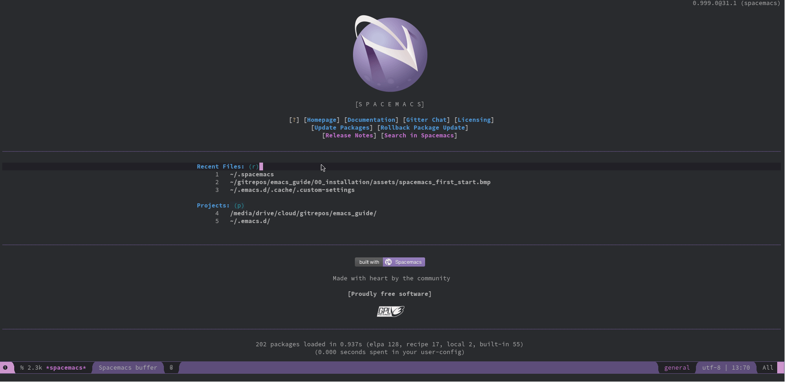

** Split window vertical

  - =split-window-right=
  - =SPC w v= (Spacemacs)
  - =SPC w v= (Doom)

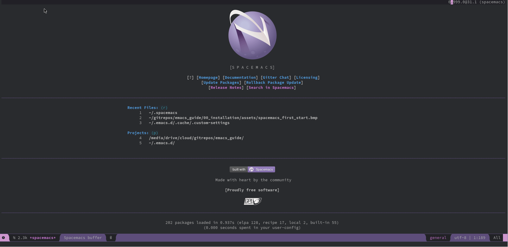

** Split window horizontal
  - =split-window-below=
  - =SPC w s= (Spacemacs)
  - =SPC w s= (Doom)

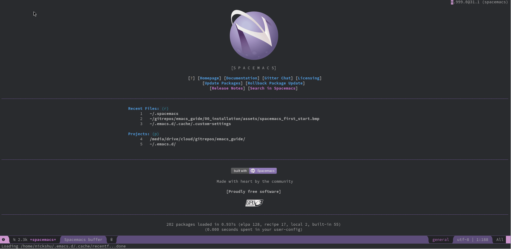

** Split window in 4 grid

  - =window-split-grid=
  - =SPC w 4= (Spacemacs)

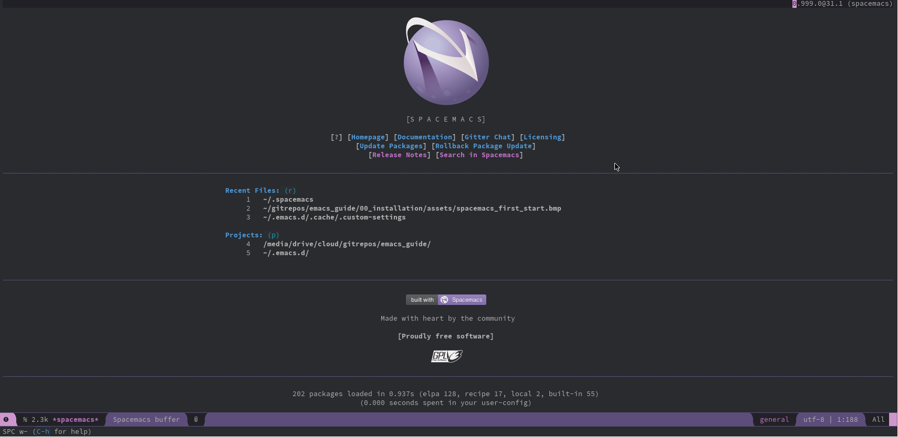

** Resize your window

  - =shrink-window-horizontally=
  - =SPC w [= (Spacemacs)
  - =C-x {= (Vanilla / Doom)
  - =enlarge-window-horizontally=
  - =SPC w ]= (Spacemacs)
  - =C-x }= (Vanilla / Doom)

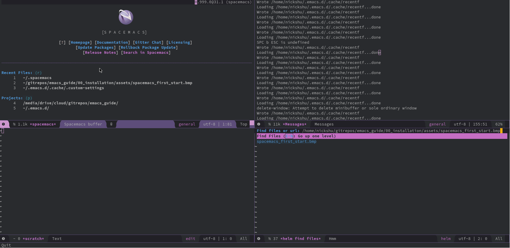

** Swapping Windows

  - =winum-select-window-{number}= (e.g. =winum-select-window-4=)
  - =SPC {number}= / =M-{number}= (e.g. =SPC 4= or =M-4=) (Spacemacs)
  - =M-m {number}= (e.g. =M-m 4=) (Vanilla)

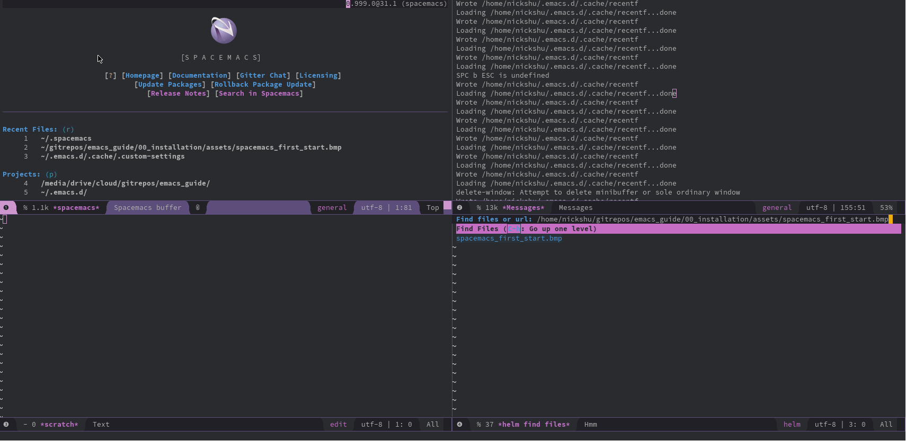

** Create a new file

- =find-file=
- =SPC f f=  (Spacemacs)
- =C-x C-f= (Vanilla)

** Save Files

- =save-buffer=
- =SPC f s=
- =C-x C-s= (Vanilla)
- =:w= (using Evil)

** Package Management

You may install packages on Emacs, which may vary on the flavor of Emacs.

- Vanilla Emacs utilizes the =~/.emacs.d/init.el=
- Spacemacs is configured in =~/.spacemacs=
- Doom Emacs is configured in 3 locations

** Python Black

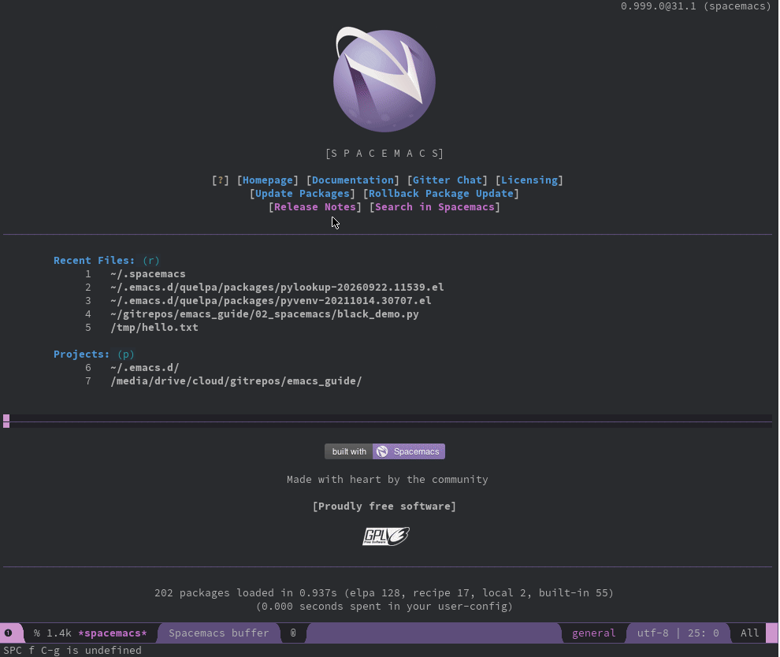

** CSV Modes

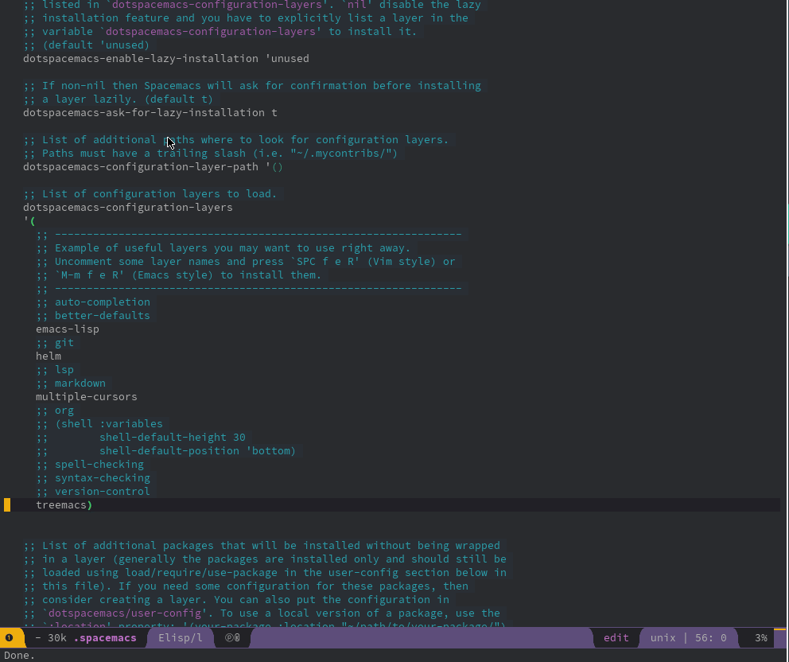

* Text Editor

** Treemacs

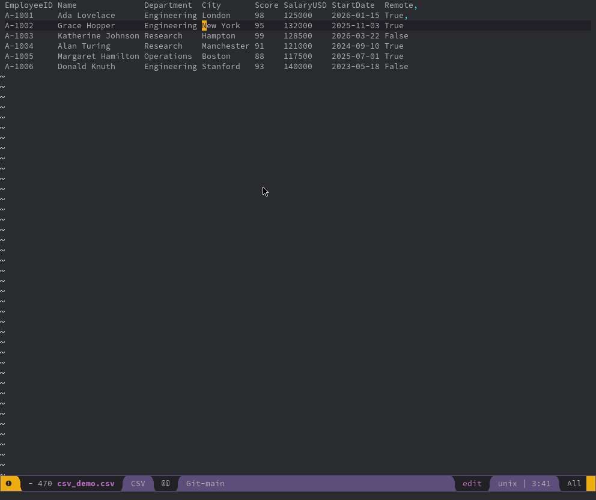

** Undo Tree

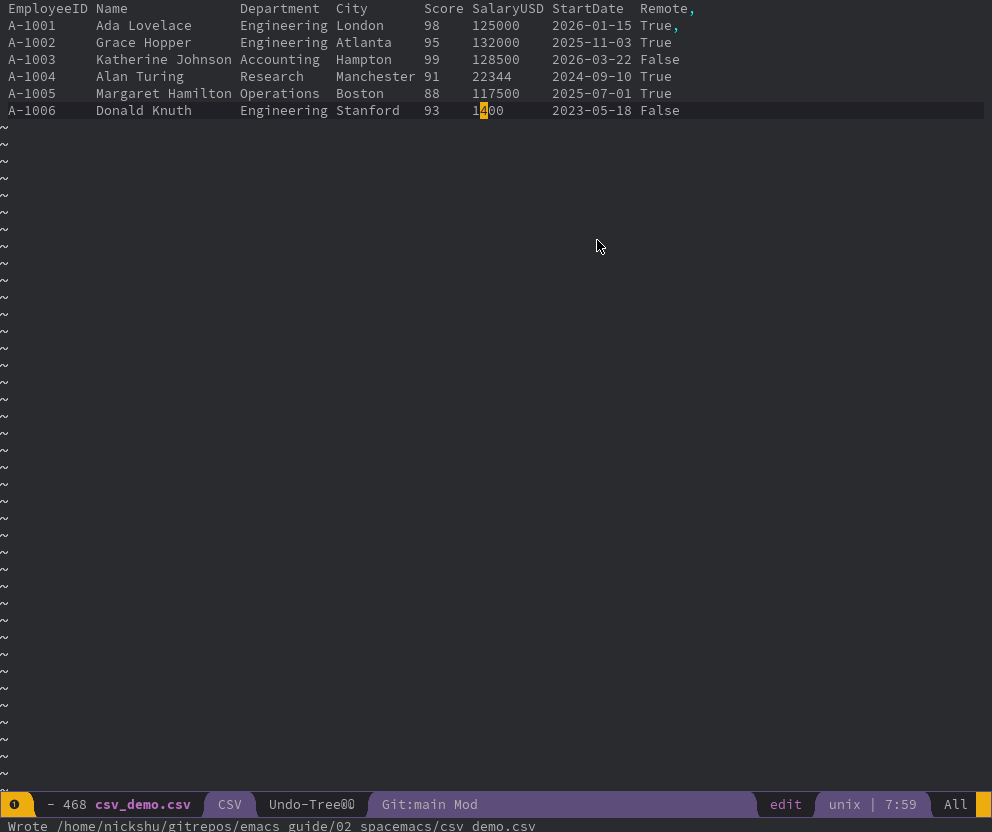

* Dired

Dired is a very powerful file manager

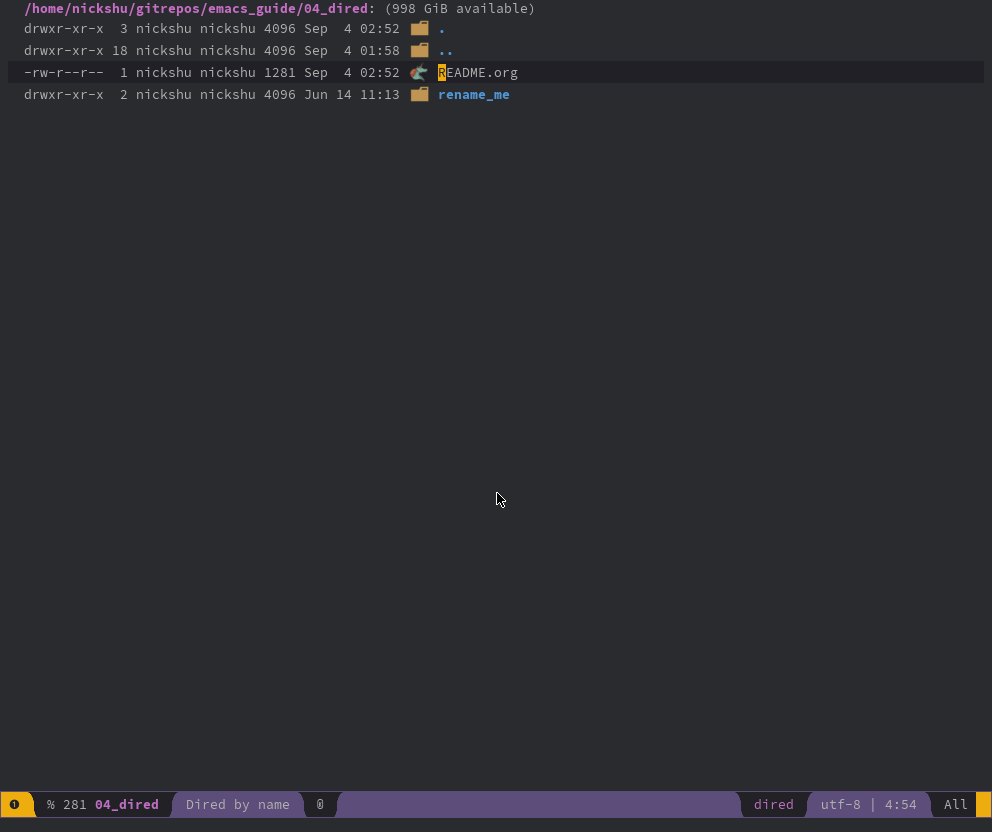

** Dired edits a buffer

* Org-Mode

* Org-Mode + LaTeX

* Literate Programming

* Org-Roam

* Org-Journal

* Magit

* Citar

* Jupyter / Julia

* Custom Scripts
